# Development

If you're interested in helping out, CPAH is an open source project and I welcome bug reports,
suggestions, and merge requests!

## Running from source

If you'd like to run CPAH from source and you're on Windows,
install [git](https://git-scm.com/download/win){target=_blank} and
[Python 3.7](https://www.python.org/downloads/release/python-379/){target=_blank},
then execute the following in PowerShell (CMD should work but we live in the future):

```ps1
PS> git clone https://gitlab.com/jkchen2/cpah.git
PS> cd cpah
PS> python -m pip install poetry
PS> python -m poetry install
PS> python -m poetry shell
PS> python entrypoint.py
```

### Compiling

To freeze CPAH to a binary,
follow the above steps for running from source (sans the last line),
create a new file in the project directory named `VERSION` with the version text in it, and run:

```ps1
PS> poetry install --extras build
PS> pyinstaller cpah.spec
```

### Linting

To lint code, follow the above steps for running from source (sans the last line), and run:

```ps1
PS> poetry install --extras lint
PS> black cpah tests
PS> mypy cpah tests
```

### Testing

To run tests, follow the above steps for running from source (sans the last line), and run:

```ps1
PS> poetry install --extras test
PS> pytest --black --mypy cpah tests
```

### Documentation

To build docs, follow the above steps for running from source (sans the last line), and run:

```ps1
PS> poetry install --extras docs
PS> mkdocs serve
```

Then visit [http://localhost:8000](http://localhost:8000){target=_blank}
for the [MkDocs](https://www.mkdocs.org/){target=_blank} generated documentation.

## CI Pipeline

CPAH is built and released using GitLab's CI pipeline.

To access the builds from a certain branch, visit the
[pipelines page](https://gitlab.com/jkchen2/cpah/-/pipelines){target=_blank},
then filter by branch name. Select the build stage of the desired pipeline run:

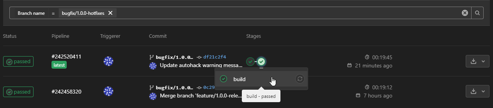

On the information bar on the right side under `Job artifacts`, select `Browse`:

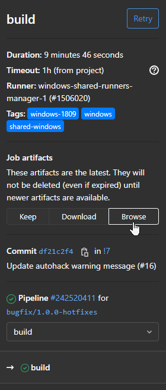

The binary is located under the `dist` directory:

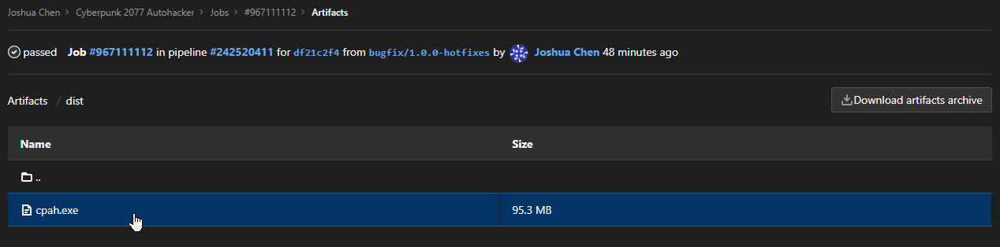

## Adding languages

While the CPAH program itself is fixed to English,
it can be configured to analyze screenshots of Cyberpunk running in other languages.

Currently, the following analysis languages are supported (not all daemons may be supported):

| Language       | Notes                      |
| -------------- | -------------------------- |
| العربية | Missing quest daemons      |
| Deutsch        | Missing some quest daemons |
| English        |                            |
| Español       | Missing quest daemons      |
| Français      | Missing quest daemons      |
| Italiano       | Missing quest daemons      |
| 日本語      | Missing quest daemons      |
| 한국어      | Missing quest daemons      |
| Polski         | Missing quest daemons      |
| Português     | Missing quest daemons      |
| Русский | Missing quest daemons      |
| 简体中文   | Missing some quest daemons |

In order to add new language support (or augment existing support),
several template images will need to be saved for each part of the breach protocol screen,
and translations for daemons will have to be added to a file.

### Template images

!!! warning
    Before creating template images, there are some hard requirements.
    The game *must* be running at 1080p and a screenshot of the game window *must* be in 1920x1080. 
    Additionally, the gamma correction must be set to 1 (the default).
    Screenshots must be in lossless quality.
    All template images should have consistently 2 to 3 pixels bordering
    the content (unless there is no room).

    Datamine v1, v2, and v3 daemons may have a hard time being detected at lower resolutions.
    It may be better to create a template image of the numeric portion of the name instead.

    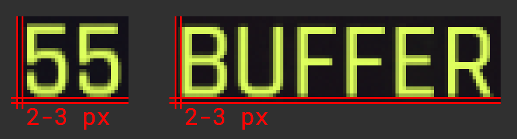

Below is an example of a proper screenshot with template image regions labeled:

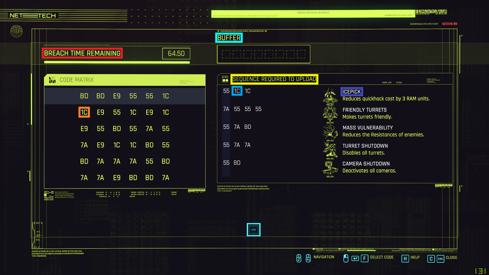

| Color  | Filename                 | Example                                                           | Required?                              |
| ------ | ------------------------ | ----------------------------------------------------------------- | -------------------------------------- |
| Red    | `title_breach.png`       |          | Required                               |
| Cyan   | `title_buffer.png`       |          | Required                               |
| Yellow | `title_sequences.png`    |    | Required                               |
| Purple | `daemon_<name>.png`      |  | Optional -- list of daemon names below |
| Orange | `code_<index>.png`       |                      | May be optional -- see below           |
| Blue   | `code_<index>_small.png` | 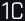         | May be optional -- see below           |

#### Daemons

!!! note
    Not all daemon template images need to be included.
    The common ones and the perk unlocked ones are good to include,
    but CPAH should still be able to handle daemons that aren't included
    by labeling them as "unknown".

| Filename                             | Image                                                                                  | Daemon type              |
| ------------------------------------ | -------------------------------------------------------------------------------------- | ------------------------ |
| `daemon_datamine_v1.png`             | 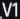                         | Common                   |
| `daemon_datamine_v2.png`             | 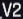                         | Common                   |
| `daemon_datamine_v3.png`             | 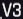                         | Common                   |
| `daemon_icepick.png`                 |                                  | Common                   |
| `daemon_mass_vulnerability.png`      |            | Perk unlocked            |
| `daemon_camera_shutdown.png`         |                  | Perk unlocked            |
| `daemon_friendly_turrets.png`        |                | Perk unlocked            |
| `daemon_turret_shutdown.png`         |                  | Perk unlocked            |
| `daemon_optics_jammer.png`           |                      | Legendary: Reboot Optics |
| `daemon_weapons_jammer.png`          |                    | Legendary: Weapon Glitch |
| `daemon_datamine_copy_malware.png`   |      | Quest: The Pickup        |
| `daemon_neutralize_malware.png`      |            | Quest: The Pickup        |
| `daemon_gain_access.png`             |                          | Quest: Space Oddity      |
| `daemon_datamine_crafting_specs.png` |  | Quest: Spellbound        |

*[Legendary: Reboot Optics]: Obtainable via crafting (may require an edited save file or mods)
*[Legendary: Weapon Glitch]: Obtainable via crafting
*[Quest: The Pickup]: Seen when hacking the datashard from Meredith Stout
*[Quest: Space Oddity]: Seen when hacking the briefcase at the start of the mission
*[Quest: Spellbound]: Seen when hacking the Book of Spells when picked up by R3n0

!!! note
    When screenshotting daemons, take note of the gap size between daemon names and codes.
    If the gap size is larger or smaller than the default (70-71 pixels),
    it must be specified in the `meta.json` file with a `daemons_gap_size` key as a float.

    For example, the daemons gap size for Simplified Chinese is 62 pixels:
    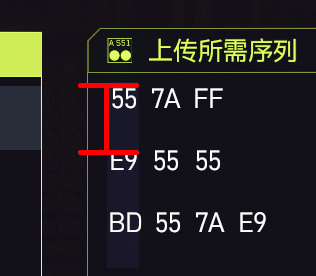

    See the example `meta.json` file for Simplified Chinese below for more.

#### Codes

!!! note
    Code images are only required if your language changes the appearance
    of the codes compared to English. For example, there are some subtle differences
    between the code appearance in English vs simplified Chinese:

    | English | Simplified Chinese |
    | ------- | ------------------ |
    | 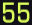   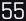  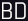 | 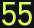   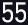   |

!!! note
    When making code template images, be sure to only use codes
    that aren't under the first row or column highlight.
    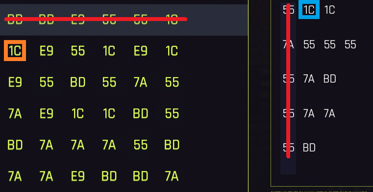

| Filename (normal) | Filename (small)   | Image (normal)                                | Image (small)                                             |
| ----------------- | ------------------ | --------------------------------------------- | --------------------------------------------------------- |
| `code_0.png`      | `code_0_small.png` |  |  |
| `code_1.png`      | `code_1_small.png` |  |  |
| `code_2.png`      | `code_2_small.png` |  |  |
| `code_3.png`      | `code_3_small.png` |  |  |
| `code_4.png`      | `code_4_small.png` |  | 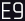 |
| `code_5.png`      | `code_5_small.png` |  |  |


### Metadata file

In addition to the images described above, a metadata file needs to be written, named `meta.json`.
This file should contain the name of the language that shows up in the UI, as well as the
text content for the daemons of the template images. Like before, these translations aren't
mandatory, but should be provided if possible. For example:

=== "**`meta.json`** (English)"
    ```json
    {
        "name": "English",
        "daemons": {
            "datamine_v1": "DATAMINE_V1",
            "datamine_v2": "DATAMINE_V2",
            "datamine_v3": "DATAMINE_V3",
            "icepick": "ICEPICK",
            "mass_vulnerability": "MASS VULNERABILITY",
            "camera_shutdown": "CAMERA SHUTDOWN",
            "friendly_turrets": "FRIENDLY TURRETS",
            "turret_shutdown": "TURRET SHUTDOWN",
            "optics_jammer": "OPTICS JAMMER",
            "weapons_jammer": "WEAPONS JAMMER",
            "datamine_copy_malware": "DATAMINE: COPY MALWARE",
            "neutralize_malware": "NEUTRALIZE MALWARE",
            "gain_access": "GAIN ACCESS",
            "datamine_crafting_specs": "DATAMINE: CRAFTING SPECS"
        }
    }
    ```

=== "**`meta.json`** (Simplified Chinese)"
    ```json
    {
        "name": "简体中文",
        "daemons_gap_size": 62.0,
        "daemons": {
            "datamine_v1": "数据挖掘_V1",
            "datamine_v2": "数据挖掘_V2",
            "datamine_v3": "数据挖掘_V3",
            "icepick": "冰锥",
            "mass_vulnerability": "集体薄弱",
            "camera_shutdown": "摄像头关闭",
            "friendly_turrets": "友方炮塔",
            "turret_shutdown": "炮塔关闭",
            "optics_jammer": "义眼妨碍",
            "weapons_jammer": "武器妨害",
            "gain_access": "获取权限"
        }
    }
    ```

### File structure

When both the template images and metadata file are ready,
they can be added to a new directory under
[`cpah/resources/images/languages`](https://gitlab.com/jkchen2/cpah/-/tree/main/cpah/resources/images/languages){target=_blank}.
The new directory name should be the
[language tag](https://en.wikipedia.org/wiki/Language_localisation#Language_tags_and_codes){target=_blank},
with an optional sub-code if necessary.

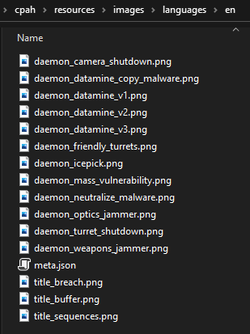

When all data has been combined, feel free to either send in the data as an attachment on an
[issue in the tracker](https://gitlab.com/jkchen2/cpah/-/issues/new?issue%5Btitle%5D=%3Clanguage%3E%20Language%20support&issue%5Bdescription%5D=Add%20attachment%20here...){target=_blank},
or submit your own merge request.
