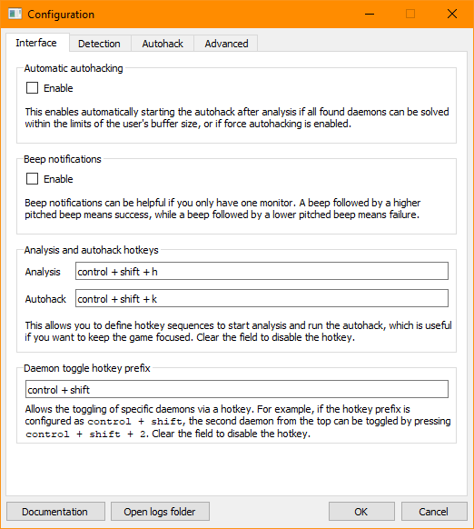

# CPAH: Cyberpunk 2077 Autohacker

This is a tool to help make the Cyberpunk 2077 Breach Protocol hacking minigame less tedious.
Check out the video below for a quick demonstration:

<video width="100%" controls muted autoplay loop>
  <source src="media/demo.mp4" type="video/mp4">
  Your browser does not support HTML5 Video.
</video>

## Features

* Automatic matrix code and sequence detection using OpenCV
* Selectable daemons in case your buffer size is not large enough
* Autohacking by sending keys to solve the matrix for you
* Forced autohacking and optimized datamine rewards
* Configurable hotkeys to prevent the need to switch windows
* Sound notifications for people with only one monitor
* Configurable detection and override settings if you are playing at a small resolution
* Support for Cyberpunk running in some [other languages](development/#adding-languages)
* Support for GeForce NOW users

Internally, the code is linted with [Black](https://github.com/psf/black){target=_blank}
and [mypy](https://github.com/python/mypy){target=_blank},
tested with [pytest](https://github.com/pytest-dev/pytest){target=_blank},
frozen with [PyInstaller](https://github.com/pyinstaller/pyinstaller){target=_blank},
built with GitLab CI Pipelines, and hosted in the GitLab Package Registry.

I'm open to ideas! If you'd like to see something changed or if there's a bug,
feel free to create an issue on the project page.

### Common links

* [Source code on GitLab](https://gitlab.com/jkchen2/cpah){target=_blank}
* [Releases on GitLab](https://gitlab.com/jkchen2/cpah/-/releases){target=_blank}
* [Issues on GitLab](https://gitlab.com/jkchen2/cpah/-/issues){target=_blank}
* [Nexus Mods page](https://www.nexusmods.com/cyberpunk2077/mods/955){target=_blank}

## Download

[Releases can be found here.](https://gitlab.com/jkchen2/cpah/-/releases){target=_blank}
Download the `cpah.exe` package under the latest release:

!!! warning
    Windows and your web browser may tell you that this file is risky.
    You'll just have to take my word for it that it's not --
    you're welcome to check out the source code for yourself.

    Alternatively, if you're willing to give me money so that I can buy a code signing license,
    I'd be open to that :^)

If you're wondering why the binary is about 100 MB large, see the [FAQ](#faq).

## Usage

When you start up the tool, you will be greeted with this interface:

The sections below detail what each button does.

### Analysis

To begin analysis, click the `Analyze` button. Alternatively, you can press the hotkey
if you have it configured (by default, this is ++ctrl+shift+h++).

CPAH will focus the Cyberpunk game window, take a screenshot, and look for key parts of the
breach protocol screen (such as the text, code matrix, sequences, and buffer size).
If these elements are found, CPAH will display these elements on the UI.

CPAH will try to find the shortest solution from all the given daemons.
If a solution is found and your buffer size is large enough, it will display the solution
over the matrix, as well as the list of daemons to the right:

!!! note
    Analysis works best if you are running your game at 1080p. If you are running at a lower
    resolution, you may need to lower some detection thresholds. See the
    [configuration section below](#detection-thresholds) for more.

If a solution is found but it is too long, you can click on the daemons on the right to choose
which daemons you want to keep, and which ones to ignore:

If you have configured CPAH to enable automatic autohacking, autohacking will begin immediately
after analysis if a solution can be found for all daemons.

### Autohacking

If CPAH found a valid solution, autohacking will become available. Clicking the `Autohack`
button will focus the Cyberpunk game window and press a combination of
++up++, ++down++, ++left++, ++right++, and ++f++ keys to automatically solve the minigame for you
based on the daemons you selected.

!!! warning
    **It is very important that you do not move your mouse while CPAH is autohacking!**
    Moving the mouse will reset the position of the cursor in the code matrix, which will make
    CPAH input an invalid solution.

!!! note
    If you are running Cyberpunk as an administrator, you will also need to run CPAH as an
    administrator, otherwise autohacking will not work.

    Additionally, autohacking requires Cyberpunk 1.05 or newer.

### Configuration

CPAH can be configured to be more friendly for single monitor users, and for those running
Cyberpunk at a resolution smaller than 1080p.

=== "Interface Settings"
    

=== "Detection Settings"
    

=== "Autohack Settings"
    

=== "Advanced Settings"
    

Each section in the configuration screen has a small description detailing what it does, which
should provide enough information to be self-explanatory. However, here are a few more details
for some specific options:

#### Analysis and autohack hotkeys

The analysis hotkey field defines the hotkey that runs analysis if pressed. It is a `+` delimited
list of keys. By default, this sequence is `control + shift + h`. Below is a table listing some
example hotkeys:

| Hotkey sequence        | Keys                 |
| ---------------------- | -------------------- |
| `control + shift + h`  | ++control+shift+h++  |
| `super + f1`           | ++windows+f1++       |
| `control + alt + kp_5` | ++control+alt+num5++ |
| `control + home`       | ++control+home++     |

The same applies to the autohack hotkey, except that one controls the autohack.

#### Daemon toggle hotkey prefix

To further reduce the hassle of needing to tab out of the game to toggle daemons,
you can add an additional hotkey for toggling found daemons.

For example, if you configure the hotkey prefix to be ++control+shift++,
you can press ++control+shift+2++ to toggle the second daemon in the list.
These hotkeys will be enabled for number keys 1 through 8.

#### Detection thresholds

If you are playing at a resolution smaller than 1080p (1920 x 1080), CPAH may fail to correctly
read screen elements. You can configure the thresholds for the detection of certain elements if
you find that CPAH is having issues.

Here is a screenshot with elements labeled:

| Color  | Description           | Default threshold |
| ------ | --------------------- | ----------------- |
| Red    | Core text elements    | 0.7               |
| Orange | Matrix codes          | 0.7               |
| Cyan   | Buffer boxes          | 0.7               |
| Blue   | Daemon sequence codes | 0.7               |
| Purple | Daemon names          | 0.7               |

The defaults are values that work well if playing the game at 1080p.
The lower the resolution, the lower the detection threshold for certain elements need to be.
There isn't an exact mapping between screen resolutions and detection thresholds,
so you may need to play around with them and see what works for you.
However, take care as to not set them too low, otherwise CPAH will exhibit strange behavior.
It is recommended that threshold values should be 0.5 or greater.

!!! note
    Buffer box detection is the hardest at lower resolutions -- sometimes lowering the detection
    for buffer boxes doesn't help. In this case, you can set a buffer size override instead.

#### Forced autohacking

Sometimes, you want to have CPAH automatically deselect daemons to always produce a
solvable puzzle after analysis. Force autohacking allows for this.
Additionally, you can choose which daemons to keep selected.

Lastly, if you enable forced autohacking and you run analysis on a breach protocol puzzle
composed of only datamine daemons, CPAH will try to maximize cash and component rewards.

#### Sequential hotkey actions

To reduce the hassle of needing to tab out of the game to interact with the CPAH GUI,
you can enable sequential hotkey actions so that the hotkey can do multiple actions.

Upon pressing the analysis hotkey the first time, a standard analysis will be run.
If the hotkey is pressed again within the timeout period,
daemons will be deselected until autohacking is possible (similar to the "force autohack" feature).
If the hotkey is pressed again within the timeout period
and autohacking is already or now possible, it will initiate the autohack.

### GeForce NOW support

If you are running Cyberpunk through GeForce NOW, you must tweak a few settings in CPAH
before it can work as intended. All these settings are in the "Advanced" tab.

First, you must change the game window title from `Cyberpunk 2077 (C) 2020 by CD Projekt RED`
to `Cyberpunk 2077® on GeForce NOW`.

Second, you must enable AutoHotkey support, as CPAH cannot send keyboard input to the
GeForce NOW window by itself.  Note that this requires an
[installation of AutoHotkey](https://www.autohotkey.com/){target=_blank}.
If AutoHotkey is not installed in the default directory, you will have to specify
the location of the AutoHotkey.exe executable.

Once those options are set, you should be able to use CPAH with GeForce NOW as if you were
running Cyberpunk natively on your computer.

## Debugging

If CPAH encounters an unhandled error, it will display a traceback and exit.
All logs are also recorded to a log file located at
`%AppData%\cp2077_autohack\log.txt`.
If sending information in to debug a problem, this is an important file to include.

Additionally, if there is a problem with the configuration file being corrupt,
it can be manually edited or removed at
`%AppData%\cp2077_autohack\config.json`

## Uninstallation

If you'd like to remove CPAH from your system, all you need to do is delete the executable.

CPAH stores log files and the configuration file in `%AppData%\cp2077_autohack` as well.
That directory can be removed as well if necessary.

## FAQ

**Q: Why is the binary so large?**

A: The binary bundles several Python modules with PyInstaller.
The biggest module is `opencv-python-headless`, which by itself accounts for about 50 MB.
The rest is a mix of `PySide2` (the Qt framework), `Pillow`, `pydantic`, and a few others.
All dependencies are bundled together as to avoid requiring the user to install anything else.

**Q: Why does it take so long to open?**

A: As a continuation of the previous answer, PyInstaller freezes the code into a single executable.
This executable is effectively a zip containing all of the code and an entire Python runtime.
Each time CPAH is launched, your computer has to extract the data to a temporary directory before
it can actually run the tool.

**Q: What if I don't want CPAH to take a screenshot?**

A: I promise there's nothing malicious going on -- the screenshot data is localized to the game
window and is never sent anywhere (i.e. it is processed locally on your machine). However, if
you truly don't want to have CPAH take a screenshot, you can save a screenshot you take yourself
of the breach protocol screen (fullscreen works best), then right click the `Analyze` button
and select the screenshot.

**Q: Can you support other languages?**

A: Unfortunately, I'm not willing to put in the time to support many languages myself.
However, I have added documentation on how you can help contribute to the project and add
the language data yourself [here](development/#adding-languages).
I will personally try to maintain the English and Simplified Chinese support.
