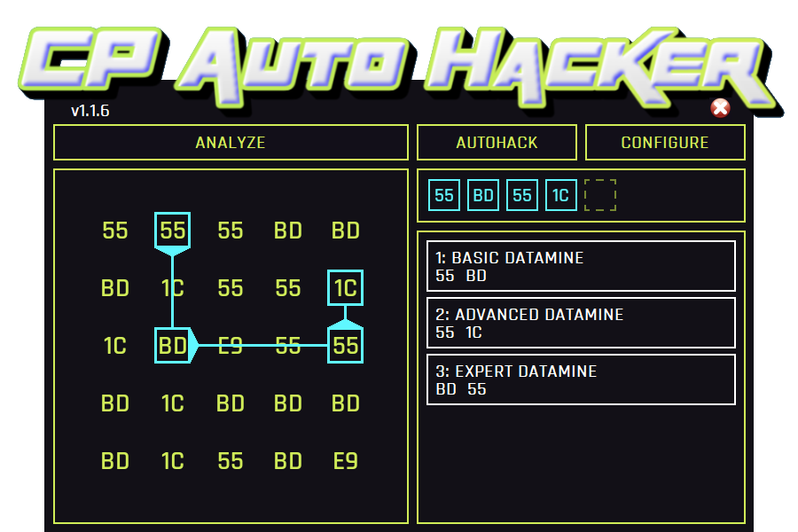
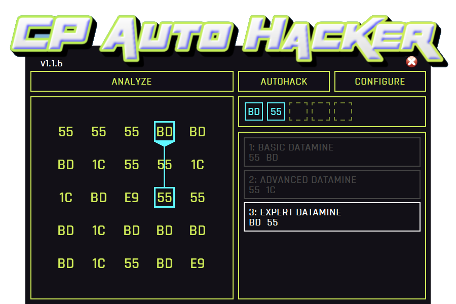
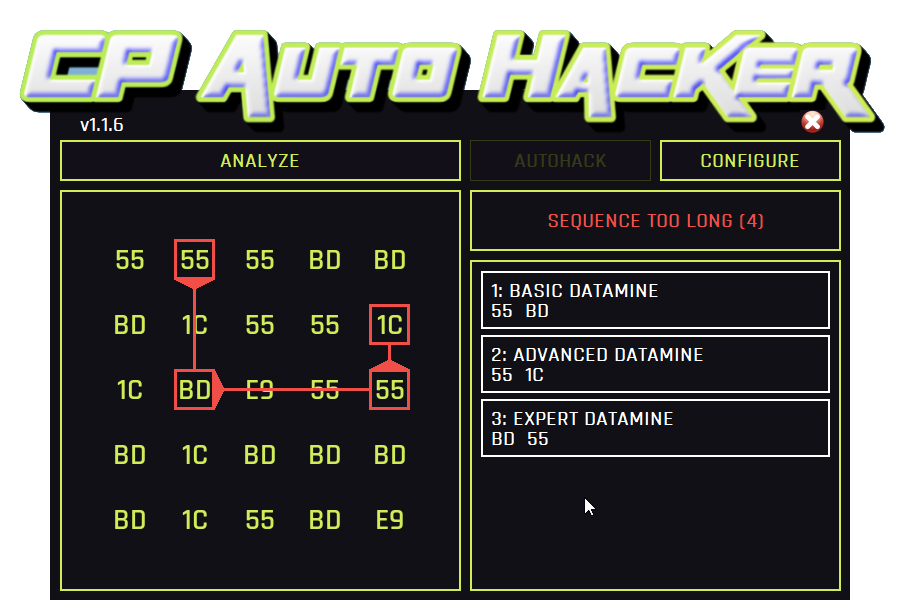
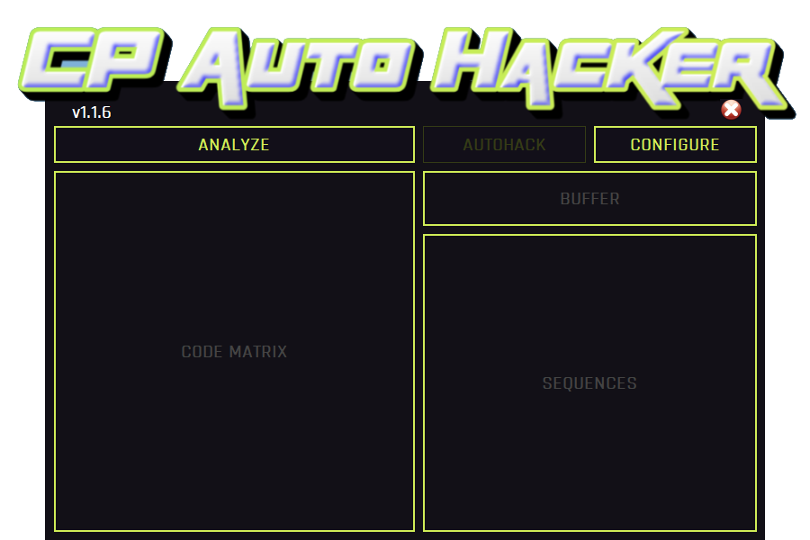
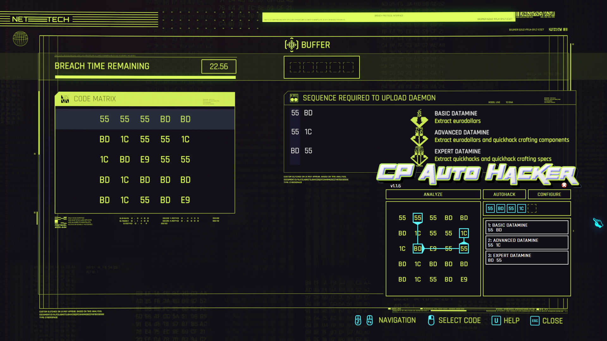

# CPAH: Cyberpunk 2077 Autohacker
Updated to work with CyberPunk 2077 v2.1 / Phantom Liberty  
Credit to Original Repo/Creator: https://gitlab.com/jkchen2/cpah 

### [Click here for the full documentation](https://dreded.gitlab.io/cpah/)

This is a tool to help make the Cyberpunk 2077 Breach Protocol hacking minigame less tedious. It will take a screenshot of the game screen, decide on the best order to solve all selected daemons and even enter in the solution for you.
## Default Hotkeys:
* CTRL + SHIFT + H = Analyze Breach Protocol Matrix (if autohack enabled in options will also enter in solution if all selected daemons can be solved)
* CTRL + SHIFT + K = AutoHack(moves the mouse for you to enter solution)
* CTRL + SHIFT + [1-9] = Enable/Disable Daemon 
## Video Demo:

### After "Analyze"

### Disabled Daemon 1 and 2

### Solution to long for buffer (buffer size = 3)

### Before "Analyze"(just opened)

### Game Window with CPAH on top
